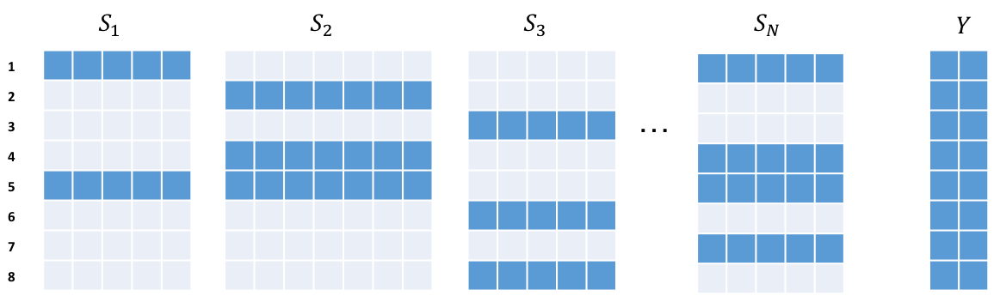
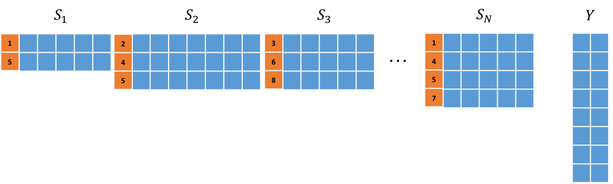

# SparseBlock
This page describes the SparseBlock format and related NN modules.
## Overview
Consider data from sensors S1, S2, ... , Sn and a sensor Y (as in figure bellow). Here the size of the signal from different sensors maybe different while all signals from a particular sensor have the same size. In a given event (corresponding to a row), the Y sensor **will** generate signal while a given S sensor **may** generate signal. Given such sensory data (collected in various events), learning tasks can be defined:

* Train a NN to predict the Y sensor signal using S sensor signals.
* Rank the S sensors, with respect to the information each provide about sensor Y.



For such tasks, using a non-sparse representation as in the above figure, will be inefficient. Hence a sparse representation called **SparseBlock** is used as shown in figure bellow (and described next). The term "**Block**" here is used for referring to the pair of event ids (in orange) and signal data (in blue) for a given S sensor.



## Data Format
The data for Si sensors would be represented in SparseBlock format using lua tables and torch tensors as following:

```lua
{ nBatchSize = m -- Total number of events in the dataset
  taData = { {teRowIdx = teIdxSet1, -- A (nS1 x 1) LongTensor which holds the event ids for which S1 has signal 
              teValue = teSignalSet1 -- A (nS1 x nSizeS1) Tensor whih holds the corresponding signal values in teIdxSet1
             },
             {teRowIdx = teIdxSet2, -- A (nS2 x 1) LongTensor which holds the event ids for which S2 has signal 
              teValue = teSignalSet2 -- A (nS2 x nSizeS2) Tensor whih holds the corresponding signal values in teIdxSet2
             },
         --[[.
             .
             . --]]
             {teRowIdx = teIdxSetN, -- A (nSN x 1) LongTensor which holds the event ids for which Sn has signal 
              teValue = teSignalSetN -- A (nSN x nSizeSN) Tensor whih holds the corresponding signal values in teIdxSetN
             }
           }
}
```
For the Y sensor data however, a single torch tensor with m rows is used where m is the number of events.


## Back-propagation ##
For calculation of local gradients using back-propagaion, the common [nn module](https://github.com/torch/nn/blob/master/doc/module.md) torch api is followed.

Given the sparse input representation, individual layers preserve the sparsity across layers by avoiding the "bias" term in various layers hence avoiding computations involving zero records throughout. Although avoiding the "bias" is acceptable in some applications it limits the modelling capacity of the network hence **it is important to add support for the bias term in future.**

A key insight in efficient implmentation of back-propagation given SparseBlcok format: when the module input is zero, there is no contribution of the back-propagated error to the local gradient, hence those calculations are omitted.

## Example ##

SparseBlock modules can be stacked on top of each other and used in combination with other torch nn modules. For example the following builds a CNN:

```lua
local mSeq = nn.Sequential()

-- First Convolutional layer with window size: 4, output channel size: 5
mSeq:add(nn.SparseBlockTemporalConvolution(1, 5, 4)
mSeq:add(nn.SparseBlockReLU())
mSeq:add(nn.SparseBlockTemporalMaxPooling(4)
mSeq:add(nn.SparseBlockDropout(0.2))

-- First Convolutional layer with window size: 4, output channel size: 10
mSeq:add(nn.SparseBlockTemporalConvolution(5, 10, 4)
mSeq:add(nn.SparseBlockReLU())
mSeq:add(nn.SparseBlockTemporalMaxPooling(4)
mSeq:add(nn.SparseBlockDropout(0.2))

-- Convert into two dimensional Blocks and apply Linear transformation
mSeq:add(nn.SparseBlockFlattenDim3())
mSeq:add(nn.SparseBlockLinear(2, false))

-- Apply Linear transformation producing "dense" output format and a final nn.Sigmoid.
mSeq:add(nn.SparseBlockToDenseLinear(1, false))
mSeq:add(nn.Sigmoid())

-- forward (data should be in SparseBlock format)
local tePredY = mSeq:forward(taDataSparseBlockFormat)

-- backward (teY tensor containing data for Y sensor)
local teErr = nn.MSECriterion():backwrad(tePredY, teY)
mSeq:backward(taDataSparseBlockFormat, teErr)
```

## Modules ##
The SparseBlock modules take input in the SparseBlock format (instead of tensor). When it comes to output format however, there are two types of modules:

* *Symmetric* modules where output is in SparseBlock format hence only SparseBlock nn modules can be stacked on top of them:

  * [SparseBlockTemporalConvolution](#nn.SparseBlockTemporalConvolution)
  * [SparseBlockTemporalMaxPooling](#nn.SparseBlockTemporalMaxPooling)
  * [SparseBlockReLU](#nn.SparseBlockReLU)
  * [SparseBlockDropout](#nn.SparseBlockDropout)
  * [SparseBlockFlattenDim3](#nn.SparseBlockFlattenDim3)
  * [SparseBlockLinear](#nn.SparseBlockLinear)
  * [SparseBlockSum](#nn.SparseBlockSum)

* *Asymmetric* modules where output is torch tensor hence any torch nn module can be stacked on top of them:

  * [SparseBlockToDenseLinear](#nn.SparseBlockToDenseLinear)
  * [SparseBlockToDenseSum](#nn.SparseBlockToDenseSum)


<a name="nn.SparseBlockTemporalConvolution"></a>
### SparseBlockTemporalConvolution ###
```lua
module = nn.SparseBlockTemporalConvolution(inputFrameSize, outputFrameSize, kW, [dW], [isRelax])
```
Applies 1D Convolution similar to [nn.TemporalConvolution](https://github.com/torch/nn/blob/master/doc/convolution.md#nn.TemporalConvolution) on SparseBlock input hence same module parameters apply. The same kernel is used for all S sensors.

The only new parameter is ```isRelax``` with ```false``` default value. Setting it to ```true``` means, if the signal size (i.e. Block width) for a sensor is smaller than the kernel width ```kW```, the input will be copied to output for that sensor (i.e. identity operation). This can be useful in deep convolutional networks because different Blocks can have different widths as the width of signal shrinks in deeper layers.

<a name="nn.SparseBlockTemporalMaxPooling"></a>
### SparseBlockTemporalMaxPooling ###
```lua
module = SparseBlockTemporalMaxPooling(kW, [dW], [isRelax])
```

Applies 1D max-pooling similar to [nn.TemporalMaxPooling](https://github.com/torch/nn/blob/master/doc/convolution.md#nn.TemporalMaxPooling) on SparseBlock.

The only new parameter is ```isRelax``` with ```false``` default value. Setting it to ```true``` means, if the signal size (i.e. Block width) for a sensor is smaller than the kernel width ```kW```, then use the signal size as ```kW``` for that sensor.


<a name="nn.SparseBlockLinear"></a>
### SparseBlockLinear ###
```lua
module = SparseBlockLinear(nOutputPerColumn, [bias])
```
Transforms input blocks of any size to output blocks with with of ```nOutputPerColumn``` using a linear transformation. The ```bias``` by default is set to false (```bias=true``` is not fully supported yet). 


<a name="nn.SparseBlockReLU"></a>
### SparseBlockReLU ###
```lua
module = nn.SparseBlockReLU([dMin], [dMax])
```

Applies rectified linear unit similar to [nn.ReLU](https://github.com/torch/nn/blob/master/doc/transfer.md#nn.ReLU) with additional parameters:

* ```dMin```: Inputs less than ```dMin``` will be set to ```dMin``` in output. Default value is ```0```.
* ```dMax```: Inputs greater than ```dMax``` will be set to ```dMax``` in output. Default value is ```1```.

<a name="nn.SparseBlockDropout"></a>
### SparseBlockDropout ###
```lua
module = nn.SparseBlockDropout([p])
```

Similar to [nn.Dropout](https://github.com/torch/nn/blob/master/doc/transfer.md#nn.Dropout), masks parts of the input using binary samples from a bernoulli distribution during training.

<a name="nn.SparseBlockFlattenDim3"></a>
### SparseBlockFlattenDim3 ###
```lua
module = nn.SparseBlockFlattenDim3()
```

Removes the 3rd dimention from all blocks by applying a 2D view. Since convolutional layer adds 3rd dimention through additional output frames this modules becomes necessary when subsequent modules that take 2D blocks as input.

<a name="nn.SparseBlockSum"></a>
### SparseBlockSum ###
```lua
module = nn.SparseBlockSum()
``` 
Calculates the sum of each block over the second dimention.

<a name="nn.SparseBlockToDenseLinear"></a>
### SparseBlockToDenseLinear ###
```lua
module = nn.SparseBlockToDenseLinear(nOutputWidth, [bias], [stdv])
```

Performs a linear transformation from all Blocks to a single tensor with size ```nBatchSize x nOutputWidth```. 

This would be equivalent the following steps (but much more efficient):

1. Convert the SparseBlock representation to non-sparse  representation.
2. Concatenate the tensors.
3. Perform [nn.Linear](https://github.com/torch/nn/blob/master/doc/simple.md#nn.Linear) transformation.

<a name="nn.SparseBlockToDenseSum"></a>
### SparseBlockToDenseSum ###
```lua
module = nn.SparseBlockToDenseSum()
``` 

Sums all Blocks over the second dimention to produce a ```nBatchSize x 1``` output tensor.
