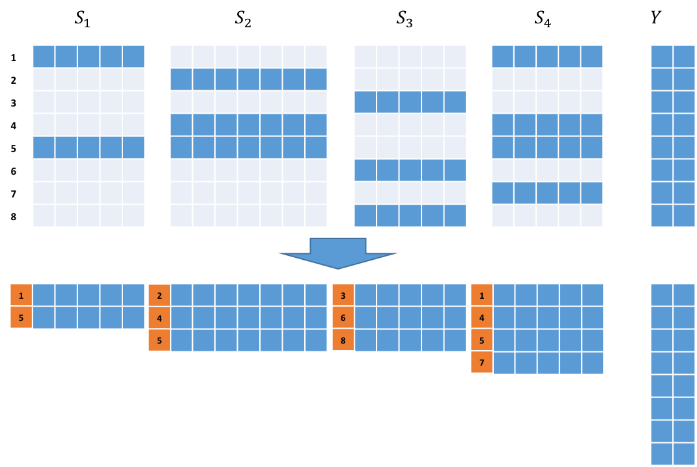

# SparseBlock Overview #
The SparseBlock modules are tailored to address the scalability challange which arise from the following problem:

Let us assume we have sensors S1, S2, ... , Sn and a sensor Y. Here we consider cases where the size of the signal from different sensors maybe different while all signals from a particular sensor have the same size. In a given event, the Y sensor **will** have a signal while a given Si sensor **may** have a signal. Given such sensory data (collected from various events), number of learning tasks can be defined (we mention two here):
* A. Train a neural network to predict the signal from Y sensor using available information from Si sensors.
* B. Rank the sensors Si, with respect to the information each provide about sensor Y (in the context of the observed events).



## Sparse Data Format
In the problem above a key observation is that for given event, a particular sensor Si, **may** have signal hence depending on the number of events for which a given sensor has a signal, it can be very sparse (e.g. in protein idetification). Therefore for Si, the sensor data is modelled using lua tables and torch tensors as following:

```lua
{ nBatchSize = m -- Total number of events in the dataset
  taData = { {teRowIdx = teIdxSet1, -- A (nS1 x 1) LongTensor which holds the event ids for which S1 has signal 
              teValue = teSignalSet1 -- A (nS1 x nSizeS1) Tensor whih holds the corresponding signal values in teIdxSet1
             },
             {teRowIdx = teIdxSet2, -- A (nS2 x 1) LongTensor which holds the event ids for which S2 has signal 
              teValue = teSignalSet2 -- A (nS2 x nSizeS2) Tensor whih holds the corresponding signal values in teIdxSet2
             },
         --[[.
             .
             . --]]
             {teRowIdx = teIdxSetN, -- A (nSN x 1) LongTensor which holds the event ids for which Sn has signal 
              teValue = teSignalSetN -- A (nSN x nSizeSN) Tensor whih holds the corresponding signal values in teIdxSetN
             },
      }
```
For the Y sensor however a single torch tensor with m rows is used where m is the number of events.

## Modules ##
A SparseBlock module takes SparseBlock table input (instead of tensor).
There are two types of SparseBlock modules:
1. Both input and output are SparseBlock tables (e.g. SparseBlockReLU, SparseBlockLinear, SparseBlockTemporalConvolution).
2. Input is SparseBlock table while output is tensor (e.g SparseBlockToDenseLinear, SparseBlockToDenseAdd)
